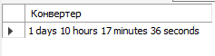
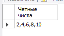

# Создайте функцию, которая принимает кол-во сек и форматирует их в кол-во дней, часов, минут и секунд.

    DROP FUNCTION IF EXISTS get_time;
    CREATE FUNCTION get_time
    (
        sec INT
    )
    RETURNS VARCHAR(45)
    DETERMINISTIC 
    RETURN 
    (
	    CONCAT(
		    FLOOR(sec / 86400), ' days ', 
		    FLOOR(sec % 86400 / 3600), ' hours ',
            FLOOR(sec % 86400 % 3600 / 60), ' minutes ',
            sec % 86400 % 3600 % 60, ' seconds'
	    )
    ); 
    SELECT get_time (123456) AS "Конвертер";

# Выведите только четные числа от 1 до 10 включительно. (Через функцию / процедуру)

    DROP PROCEDURE IF EXISTS get_number;
    DELIMITER $$ 
    CREATE PROCEDURE get_number
    (

    )
    BEGIN
	    DECLARE n INT DEFAULT 4;
        DECLARE result VARCHAR(45) DEFAULT "2";
    
        REPEAT
		    SET result = CONCAT(result, ",", n);
            SET n = n + 2;
            UNTIL n > 10
	    END REPEAT;
	    SELECT result AS "Четные числа";
    END $$
 
    CALL get_number();
